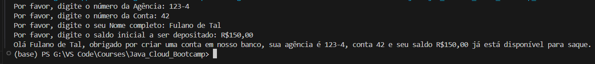

# Desafio DIO - Simulando uma Conta Bancária Através do Terminal/Console

Este projeto foi desenvolvido como parte do **Bootcamp Bradesco - Java Cloud Native** da DIO, seguindo as instruções do repositório [digitalinnovationone/trilha-java-basico](https://github.com/digitalinnovationone/trilha-java-basico/tree/main/desafios/sintaxe).

O objetivo do desafio é criar um programa simples em Java que simula a criação de uma conta bancária via terminal, solicitando informações do usuário e exibindo uma mensagem de boas-vindas.

## Sobre a aplicação

A classe `ContaTerminal` representa uma conta bancária simples com os seguintes atributos:

- **Agência**: Número da agência bancária.  
- **Conta**: Número da conta bancária.  
- **Nome do Cliente**: Nome completo do titular da conta.  
- **Saldo**: Saldo inicial depositado na conta.  

A classe conta com **getters e setters** para manipulação dos atributos privados e inclui um método que exibe uma mensagem de boas-vindas com as informações do cliente.

Além disso, há um método **main**, que simula a criação de uma conta bancária, solicitando os dados ao usuário via terminal.

## Como executar o projeto

1. **Clone o repositório**:
   ```
   git clone https://github.com/seu-usuario/seu-repositorio 
   ```
2. **Compile e execute o código**:
    ```
    javac ContaTerminal.java
    java ContaTerminal
    ```

## 🖥️ Exemplo de Execução

Ao executar o programa, o terminal exibirá mensagens solicitando os dados do cliente. Veja um exemplo:

